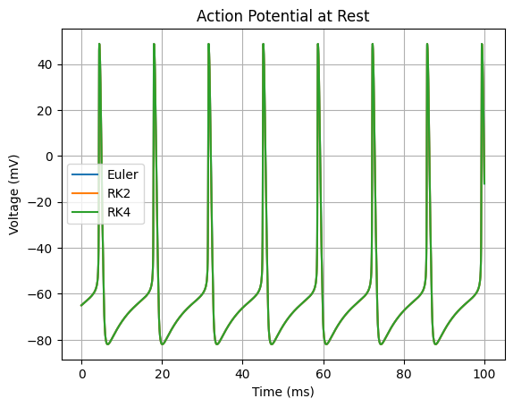

# Hodgkin-Huxley Action Potential Simulator

This is the class project of the UC Berkeley Cogsci 132 course. This program simulates the action potentials of a simple neuron by solving the Hodgkin-Huxley voltage simulation function, using Euler's or Runge-Kutta method.

This project includes:

- ODE integrator: Able to choose between Euler's method, RK2 and RK4.
- Hodgkin-Huxley toolkit: Calculate activation variables, instantaneous current, and relevant variables based on bioelectromagnetism equations.
- Voltage-clamp simulation: Simulated the sodium and potassium current in the famous voltage-clamp experiment.
- Time constant simulation: Calculated action curve and time constants of different voltages.
- Action potential simulation: Simulate the action potentials of a simple neuron when modulated by an injected current.
- Precision Comparison: Compared the precision of Euler's and Runge-Kutta methods.
